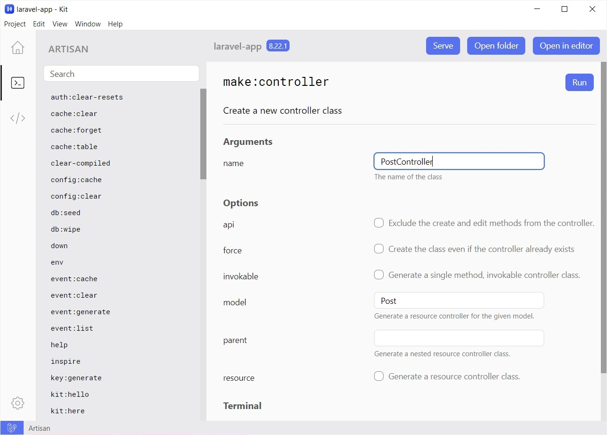
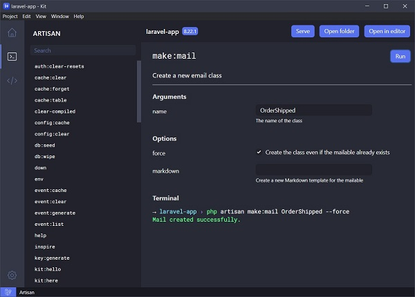
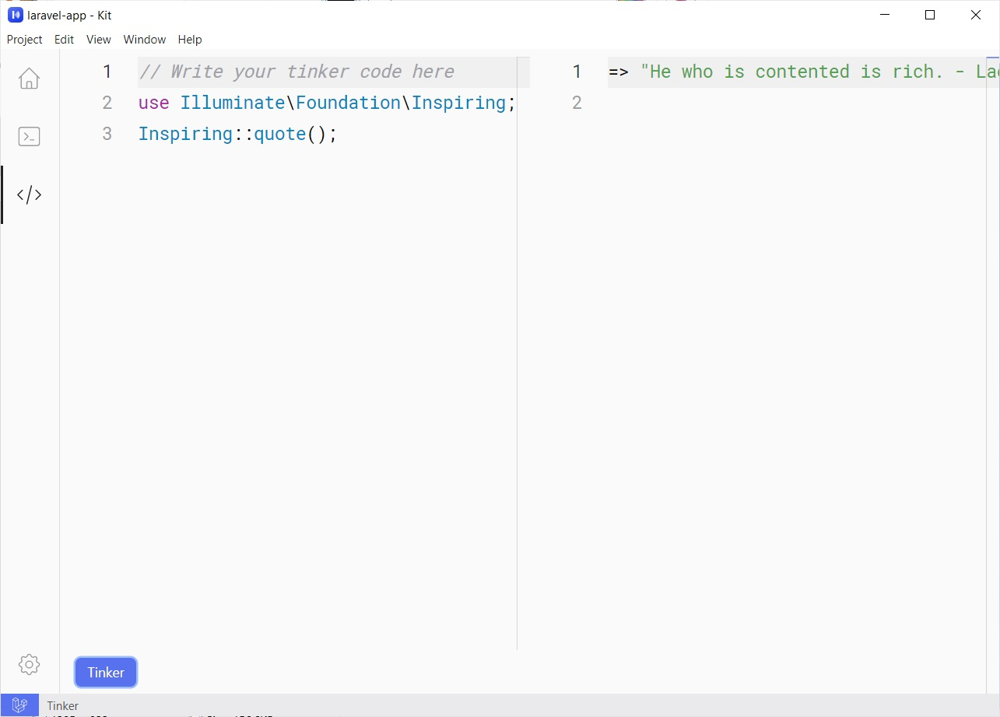
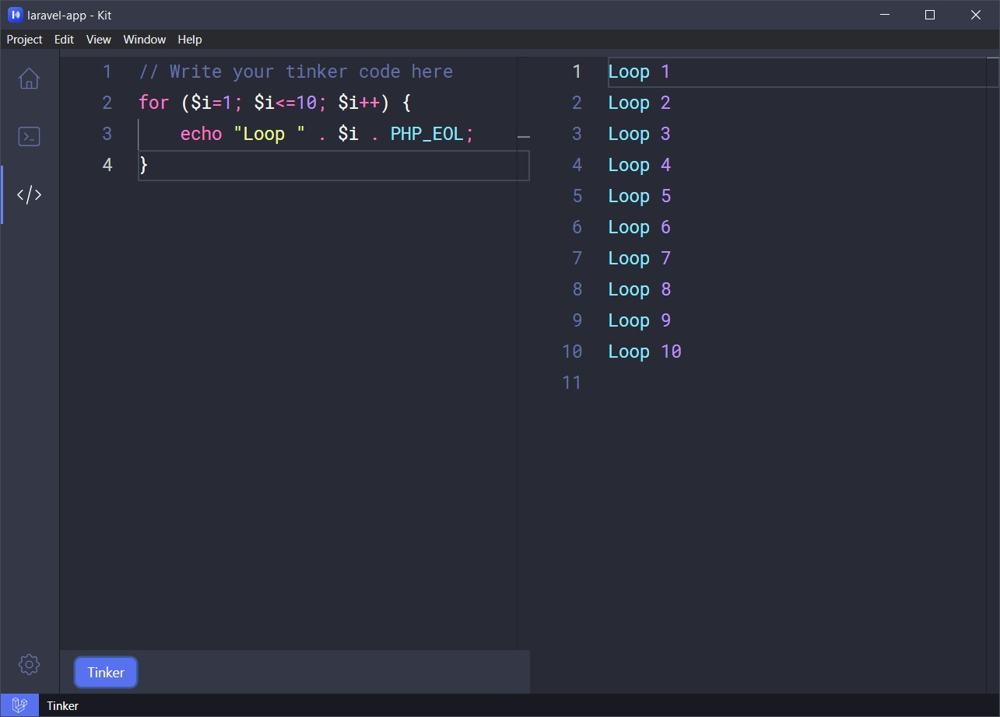

<p align="center">
  
</p>
<h1 align="center">Laravel Kit</h1>
<div align="center">
  A simple and elegant desktop application for managing your Laravel applications.<br>
  <sub>Available for Windows, Linux and macOS.</sub>
</div>
<br>
<div align="center">
  <!-- Version -->
  <a href="https://github.com/tmdh/laravel-kit/releases/latest">
    
  </a>
  <!-- Build Status -->
  <a href="https://github.com/tmdh/laravel-kit/actions/workflows/build.yml">
    
  </a>
  <!-- Downloads total -->
  <a href="https://github.com/tmdh/laravel-kit/releases">
    
  </a>
  <!-- Product Hunt total -->
  <a href="https://www.producthunt.com/posts/laravel-kit-2">
    
  </a>
</div>
<div align="center">
  <h3>
    <a href="https://tmdh.github.io/laravel-kit/">
      Website
    </a>
    <span> | </span>
    <a href="https://github.com/tmdh/laravel-kit#features">
      Features
    </a>
    <span> | </span>
    <a href="https://github.com/tmdh/laravel-kit#download">
      Downloads
    </a>
    <span> | </span>
    <a href="https://github.com/tmdh/laravel-kit#contribution">
      Contribution
    </a>
    <span> | </span>
    <a href="https://github.com/tmdh/laravel-kit/wiki">
      Documentation
    </a>
  </h3>
</div>
<div align="center">
  <sub>
  Built with ❤︎ by <a href="https://github.com/tmdh">Tareque Md Hanif</a>
  </sub>
</div>

## Features

- No configuration required.
- Execute Artisan commands easily in a nice interface.
- Tinker with your project in a magical code editor.
- Serve your Laravel application locally with a click of a button (so convenient :star_struck: ).
- Beautiful user interface inspired by VSCode and dark theme.
- Artisan commands are retrieved from your Laravel project.
- Many more features yet to come.

## Download

PHP must be installed in your system.

| Windows                                                                                                 | macOS                                                                                                                                                                                      | Linux                                                                                                                                                                                                  |
| ------------------------------------------------------------------------------------------------------- | ------------------------------------------------------------------------------------------------------------------------------------------------------------------------------------------ | ------------------------------------------------------------------------------------------------------------------------------------------------------------------------------------------------------ |
| [Setup (exe)](https://github.com/tmdh/laravel-kit/releases/download/v2.0.3/Laravel-Kit-Setup-2.0.3.exe) | [dmg](https://github.com/tmdh/laravel-kit/releases/download/v2.0.3/Laravel-Kit-2.0.3.dmg) or [zip](https://github.com/tmdh/laravel-kit/releases/download/v2.0.3/Laravel-Kit-2.0.3-mac.zip) | [AppImage](https://github.com/tmdh/laravel-kit/releases/download/v2.0.3/Laravel-Kit-2.0.3.AppImage) or [deb](https://github.com/tmdh/laravel-kit/releases/download/v2.0.3/laravel-kit_2.0.3_amd64.deb) |

You can also install Laravel Kit with [brew](https://brew.sh/).

```
brew install laravel-kit
```

## Screenshots

<h4 align="center"> :high_brightness: themes :crescent_moon: </h4>

|               Light                |               Dark                |
| :--------------------------------: | :-------------------------------: |
|  |  |
|   |   |

## Contribution

- [Request a new feature or report an issue](https://github.com/tmdh/laravel-kit/issues/new/).

## Documentation

Go to [Laravel Kit wiki](https://github.com/tmdh/laravel-kit/wiki).

---

Copyright © 2018-2021 by [Tareque Md Hanif](https://github.com/tmdh)
