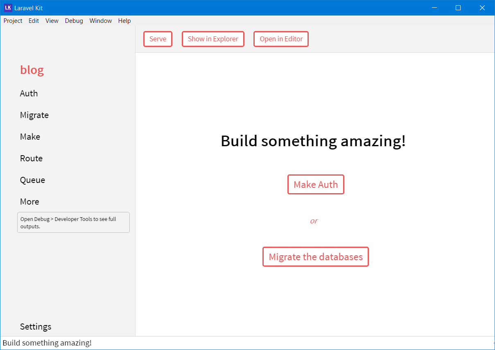
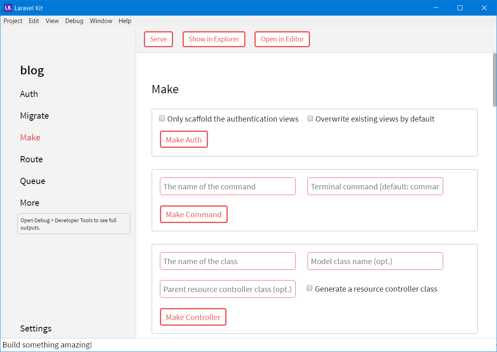
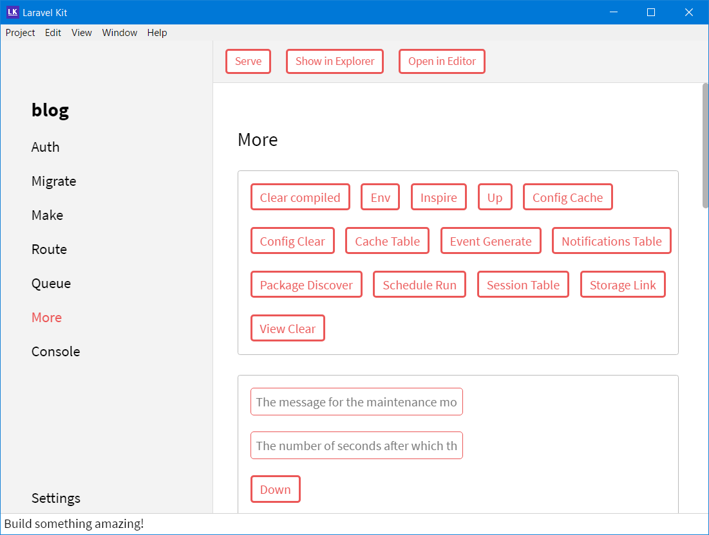

# Laravel Kit

    

Easy Laravel application management.

Laravel Kit is an open source application which can execute almost all Laravel Artisan commands without using any terminal.

## Screenshots

## Download

[Composer](getcomposer.org) with PHP is required.

| macOS                                    | Windows                                  | Linux                                    |
| ---------------------------------------- | ---------------------------------------- | ---------------------------------------- |
| [Download](https://github.com/tarequemdhanif/laravel-kit/releases/download/v1.2.0/laravel-kit-1.2.0-mac.zip) | [Download](https://github.com/tarequemdhanif/laravel-kit/releases/download/v1.2.0/laravel-kit-setup-1.2.0.exe) | [Download](https://github.com/tarequemdhanif/laravel-kit/releases/download/v1.2.0/laravel-kit-1.2.0-x86_64.AppImage) |

You can also install Laravel Kit with [brew](https://caskroom.github.io/) on macOS.

    brew cask install laravel-kit

Find out more [here](https://github.com/tarequemdhanif/laravel-kit/releases/latest).

## Features

* **Artisan commands**: You can execute 61 artisan commands with Laravel Kit.
* **Works offline**: You can create a fresh Laravel 5.5 application without any internet connection.
* Cross platform support (Windows, macOS and Linux).
* **Console**: This feature allows you to see full output of a command.
* **Package Store**: This feature allows you to install composer packages (tagged `laravel-package`).
* Beautiful UI.

## Documentation

Go to [Laravel Kit wiki](https://github.com/tarequemdhanif/laravel-kit/wiki).

## Backers

- [DigitalOcean](https://m.do.co/c/36fb62dbec41) (Get 10$ platform credit)

- [Cloudways](https://www.cloudways.com/en/?id=185419)

[Become a backer ($5/mo)](https://patreon.com/tarequemdhanif).

------

Copyright © 2018 by [Tareque Md Hanif](https://github.com/tarequemdhanif)

