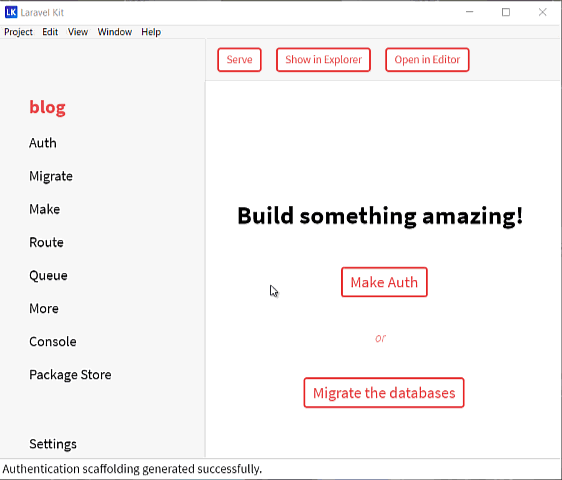

# Laravel Kit

    

Laravel Kit is a desktop application which can execute almost all Laravel Artisan commands without using any terminal.

## Download

[Composer](https://getcomposer.org) with PHP is required.

| macOS                                    | Windows                                  | Linux                                    |
| ---------------------------------------- | ---------------------------------------- | ---------------------------------------- |
| [Download](https://github.com/tmdh/laravel-kit/releases/download/v1.2.3/laravel-kit-1.2.3-mac.zip) | [Download](https://github.com/tmdh/laravel-kit/releases/download/v1.2.3/laravel-kit-setup-1.2.3.exe) | [Download](https://github.com/tmdh/laravel-kit/releases/download/v1.2.3/laravel-kit-1.2.3-x86_64.AppImage) |

You can also install Laravel Kit with [brew](https://caskroom.github.io/) on macOS.

    brew cask install laravel-kit

Find out more [here](https://github.com/tmdh/laravel-kit/releases/latest).

## Features

* **Artisan commands**: You can execute 61 artisan commands with Laravel Kit.
* **Works offline**: You can create a fresh Laravel 5.8 application without any internet connection.
* Cross platform support (Windows, macOS and Linux).
* **Console**: This feature allows you to see full output of a command.
* Beautiful UI.

## Documentation

Go to [Laravel Kit wiki](https://github.com/tmdh/laravel-kit/wiki).

------

Copyright © 2018-2019 by [Tareque Md Hanif](https://github.com/tmdh)
